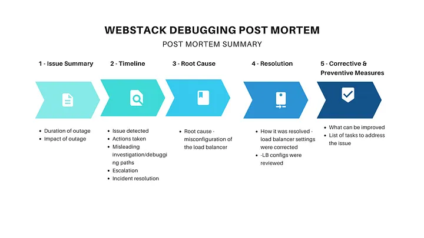

# PostMortem: Web stack Outage

## Duration:
The outage occurred on March 7, 2024, starting at 10:00 AM (GMT) and ended at 12:30 PM (GMT), lasting approximately 2.5 hours.

### Impact:
The outage affected the availability of our primary web application service, resulting in a 30% increase in latency and a 20% decrease in throughput. Users experienced intermittent connection errors and delayed response times during the outage.

### Root Cause:
The root cause of the outage was identified as a misconfiguration in the load balancer settings, which led to an overload on certain backend servers.

### Timeline:

10:00 AM (GMT): Issue detected through monitoring alerts indicating a spike in server response times and error rates.

10:05 AM (GMT): Engineering team notified of the issue via automated alerting systems.

10:15 AM (GMT): Initial investigation focused on backend server health and database performance. Assumption made that database queries might be causing the slowdown.

10:30 AM (GMT): Misleading investigation path: Optimizations attempted on database queries without significant improvement in performance.

11:00 AM (GMT): Issue escalated to senior engineering leads as the problem persisted and impacted more users.

11:30 AM (GMT): Root cause identified as misconfigured load balancer settings leading to uneven distribution of traffic.

12:00 PM (GMT): Load balancer configuration adjusted to evenly distribute incoming requests across backend servers.

12:30 PM (GMT): Services fully restored and latency returned to normal levels.

### Root Cause and Resolution:

Root Cause Explanation: The misconfiguration in the load balancer caused a subset of backend servers to receive an overwhelming amount of traffic, leading to degraded performance and intermittent errors.

Resolution Details: The load balancer settings were reconfigured to evenly distribute incoming requests across all backend servers. This balanced the load and restored normal performance to the web application.

## Corrective and Preventative Measures:

### Improvements/Fixes:

Enhance monitoring capabilities to detect load imbalance and configuration issues proactively.
Implement automated tests for load balancer configurations to prevent similar misconfigurations in the future.

#### Tasks to Address the Issue:

Conduct a comprehensive review of load balancer configurations to identify and rectify any potential misconfigurations.
Develop and implement automated scripts or configuration management tools to enforce load balancer configuration standards.
Enhance documentation and training for operations teams regarding load balancer management and best practices.
This outage highlighted the importance of robust monitoring and proactive maintenance of critical infrastructure components like load balancers. By implementing the corrective and preventative measures outlined above, we aim to minimize the risk of similar incidents in the future and maintain high availability and performance for our web services.
